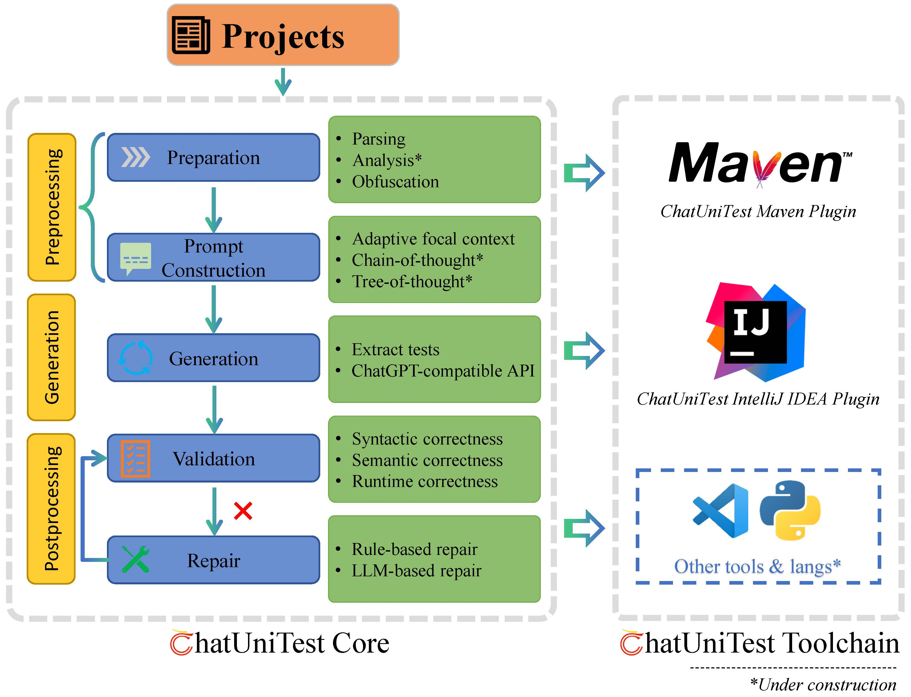

# :mega: ChatUnitest


## Background
Many people have tried using ChatGPT to help them with various programming tasks and have achieved good results. However, there are some issues with using ChatGPT directly. Firstly, the generated code often fails to execute correctly, leading to the famous saying **"five minutes to code, two hours to debug"**. Secondly, it is inconvenient to integrate with existing projects as it requires manual interaction with ChatGPT and switching between different platforms. To address these problems, we have proposed the **"Generate-Validate-Repair"** framework and implemented a prototype. Additionally, to make it easier for everyone to use, we have developed some plugins that can be seamlessly integrated into existing development workflows.

## Overview




## MISC

Our work has been submitted to arXiv. Check it out here: [ChatUniTest](https://arxiv.org/abs/2305.04764).

Please refer to the [python](https://github.com/ZJU-ACES-ISE/ChatUniTest/tree/python) branch if you want to see the original version of ChatUniTest for the paper.

```
@misc{xie2023chatunitest,
      title={ChatUniTest: a ChatGPT-based automated unit test generation tool}, 
      author={Zhuokui Xie and Yinghao Chen and Chen Zhi and Shuiguang Deng and Jianwei Yin},
      year={2023},
      eprint={2305.04764},
      archivePrefix={arXiv},
      primaryClass={cs.SE}
}
```

## :email: Contact us

If you have any questions, please feel free to contact us via email. The email addresses of the authors are as follows:

1. Corresponding author: `zjuzhichen AT zju.edu.cn`
2. Author: `yh_ch AT zju.edu.cn`, `xiezhuokui AT zju.edu.cn`
