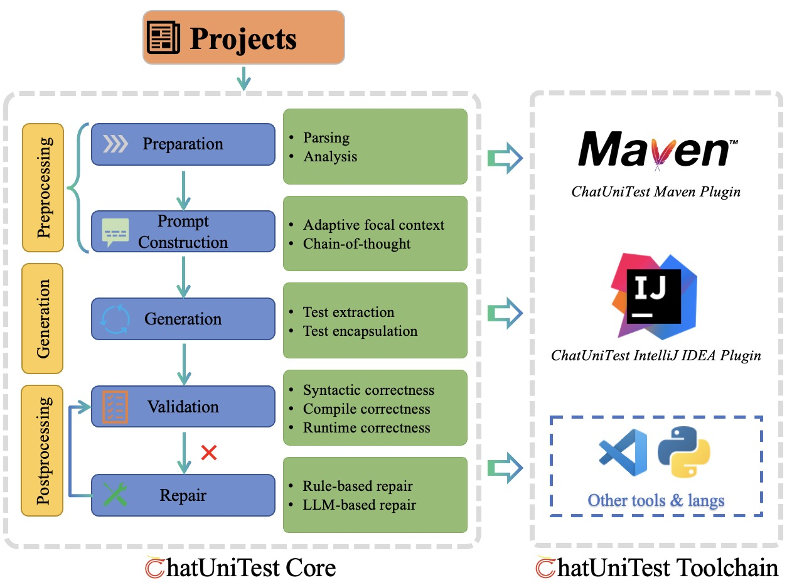

# :mega: ChatUnitest


## Background
Many people have tried using ChatGPT to help them with various programming tasks and have achieved good results. However, there are some issues with using ChatGPT directly. Firstly, the generated code often fails to execute correctly, leading to the famous saying **"five minutes to code, two hours to debug"**. Secondly, it is inconvenient to integrate with existing projects as it requires manual interaction with ChatGPT and switching between different platforms.

ChatUniTest is an innovative framework designed to improve automated unit test generation. ChatUniTest utilizes an LLM-based approach enhanced with **"adaptive focal context"** mechanism to encompass valuable
context in prompts and adheres to a **"Generation-Validation-Repair"** mechanism to rectify errors in generated unit tests. 
we have developed ChatUniTest Core, a common library that implements the core workflow, complemented by the ChatUniTest
Toolchain, a suite of seamlessly integrated tools enhancing the
capabilities of ChatUniTest. 

## Overview



### Implementations
| Publication | Implementation | Paper Titile |
| :---------: | :--: | :----------: |
| FSE'24 Demo | [ChatUniTest](https://github.com/ZJU-ACES-ISE/ChatUniTest/tree/python)<br>[maven-plugin](https://github.com/ZJU-ACES-ISE/chatunitest-maven-plugin)<br>[IDEA-plugin](https://github.com/ZJU-ACES-ISE/ChatUniTest_IDEA_Plugin)  | [ChatUniTest: A Framework for LLM-Based Test Generation](https://dl.acm.org/doi/abs/10.1145/3663529.3663801) |
| FSE'24 | [ChatTester](https://github.com/ZJU-ACES-ISE/ChatTester) | [Evaluating and Improving ChatGPT for Unit Test Generation](https://dl.acm.org/doi/abs/10.1145/3660783) |
| ICSE'24 Demo | [TestSpark](https://github.com/ZJU-ACES-ISE/TestSpark-maven-plugin) | [TestSpark: IntelliJ IDEA’s Ultimate Test Generation Companion](https://dl.acm.org/doi/abs/10.1145/3639478.3640024) |
| FSE'24 | SymPrompt <br> (Under construction) | [Code-Aware Prompting: A study of Coverage Guided Test Generation in Regression Setting using LLM](https://dl.acm.org/doi/abs/10.1145/3643769) |
| Arxiv | TELPA  <br> (Under construction) | [Enhancing LLM-based Test Generation for Hard-to-Cover Branches via Program Analysis](https://arxiv.org/pdf/2404.04966) |
| Arxiv | CoverUp <br> (Under construction) | [CoverUp: Coverage-Guided LLM-Based Test Generation](https://arxiv.org/abs/2403.16218) |
| IST'24 | MuTAP <br> (Under construction) | [Effective Test Generation Using Pre-trained Large Language Models and Mutation Testing](https://www.sciencedirect.com/science/article/abs/pii/S0950584924000739) |
| ICSE'23 | CodaMOSA <br> (Under construction) | [CodaMosa: Escaping Coverage Plateaus in Test Generation with Pre-trained Large Language Models](https://ieeexplore.ieee.org/abstract/document/10172800) |


## MISC

Our work has been submitted to arXiv. Check it out here: [ChatUniTest](https://arxiv.org/abs/2305.04764).

Please refer to the [python](https://github.com/ZJU-ACES-ISE/ChatUniTest/tree/python) branch if you want to see the original version of ChatUniTest for the paper.

```
@inproceedings{chen2024chatunitest,
  title={ChatUniTest: A Framework for LLM-Based Test Generation},
  author={Chen, Yinghao and Hu, Zehao and Zhi, Chen and Han, Junxiao and Deng, Shuiguang and Yin, Jianwei},
  booktitle={Companion Proceedings of the 32nd ACM International Conference on the Foundations of Software Engineering},
  pages={572--576},
  year={2024}
}

@misc{xie2023chatunitest,
      title={ChatUniTest: a ChatGPT-based automated unit test generation tool}, 
      author={Zhuokui Xie and Yinghao Chen and Chen Zhi and Shuiguang Deng and Jianwei Yin},
      year={2023},
      eprint={2305.04764},
      archivePrefix={arXiv},
      primaryClass={cs.SE}
}
```

## :email: Contact us

If you have any questions, please feel free to contact us via email. The email addresses of the authors are as follows:

1. Corresponding author: `zjuzhichen AT zju.edu.cn`
2. Author: `yh_ch AT zju.edu.cn`, `xiezhuokui AT zju.edu.cn`
