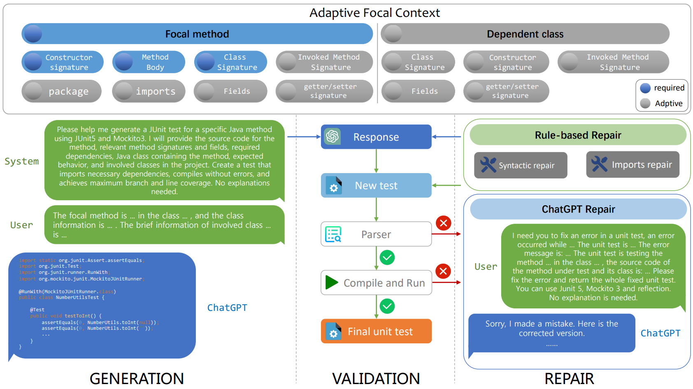

## Introduction

[中文](./Intro_zh.md)

In an environment where software scale is continuously expanding, the importance of software testing in ensuring
software quality is self-evident. Unit testing is the most basic and important part of software testing, which can help
the development team discover and locate defects in the software as early as possible. In recent years, many studies
have focused on automatically generating unit test cases to alleviate the burden on developers. However, unit test cases
generated based on traditional program analysis methods have disadvantages such as poor readability and
maintainability (such as [Evosuite](https://www.evosuite.org/), [Randoop](https://randoop.github.io/randoop/)), and unit
test cases generated based on pre-trained model methods have disadvantages such as low coverage and success rate 
(such as [AthenaTest](https://athenatestdemowebsite.azurewebsites.net/) and [A3Test](http://github.com/awsm-research/a3test)).
Therefore, we propose a unit test generation scheme based on ChatGPT and have developed a prototype tool, ChatUniTest.

In the overall architecture of ChatUniTest,
we follow the generate-verify-fix framework. For the method to be tested,
some necessary context information in the method to be tested is first collected, and ChatGPT is allowed to generate
initially. Then verify whether the test cases generated by ChatGPT are correct. If they are not correct, let ChatGPT fix
the test cases according to the error information of the compiler, and iterate in this way until the test cases are
correctly executed or the maximum number of iterations is reached.