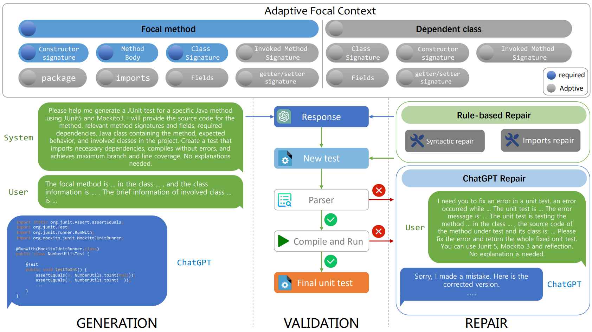

## 简介

[English](./Intro_en.md)

在软件规模不断扩大的环境中，软件测试对于保证软件质量的重要性不言而喻。
单元测试是软件测试的最基本、最重要的部分，它能够帮助开发团队尽早地发现并定位软件中的缺陷。
近年来，许多研究都关注于自动生成单元测试用例来减轻开发人员的负担。
然而，基于传统程序分析方法生成的单元测试用例存在可读性和可维护性差等缺点（如[Evosuite](https://www.evosuite.org/), [Randoop](https://randoop.github.io/randoop/))，
而基于预训练模型的方法生成的单元测试用例则存在覆盖率和成功率低等缺点
（如[AthenaTest](https://athenatestdemowebsite.azurewebsites.net/), [A3Test](http://github.com/awsm-research/a3test)）。
因此，我们提出了一种基于ChatGPT的单元测试生成方案，并开发了原型工具ChatUniTest。

ChatUniTest的整体架构如图1所示。
整体上是遵循生成-验证-修复框架，针对待测方法，首先收集一些待测方法中必要的上下文信息，
让ChatGPT进行初始生成，然后验证ChatGPT生成的测试用例是否正确，如果不正确，则根据编译器的报错信息，让ChatGPT修复测试用例，
如此循环迭代，直至测试用例正确执行，或者达到最大迭代次数。