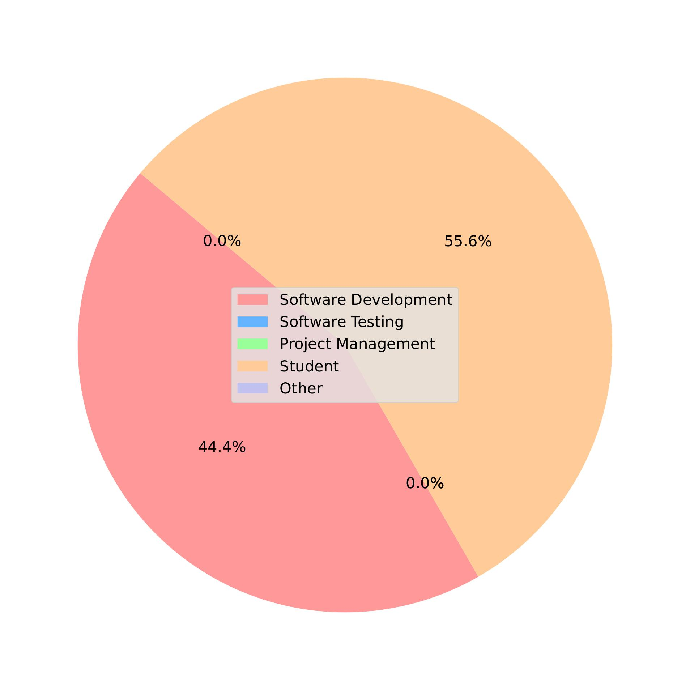
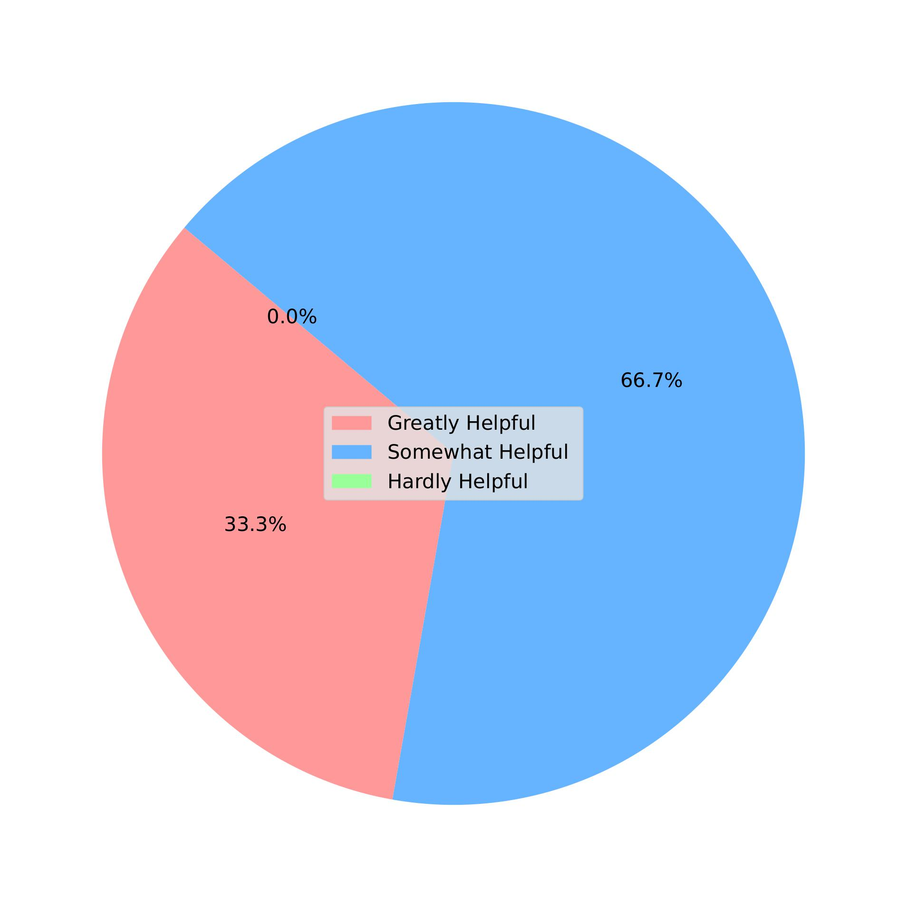

# Survey

This repository contains the survey documents for the project.

Here is the original report pdf in Chinese: [ChatUniTest_Survey_Report.pdf](ChatUniTest_Survey_Report.pdf)

## Questionaire

This is our questionnaire, containing all the questions and potential answer options we wanted to explore. 

## Answers

These are the participants' answers to our questions.

## Statistics

These are the results of our analysis of the collected responses, which can help us better understand and interpret the data.

<table>
  <tr>
    <td>
      
<strong>Q1</strong>

      
    </td>
    <td>
      
<strong>Q2</strong>

      
    </td>
  </tr>
  <tr>
    <td>
      
<strong>Q3</strong>

      
    </td>
    <td>
      
<strong>Q4</strong>

      
    </td>
  </tr>
  <tr>
    <td>
      
<strong>Q5</strong>

      
    </td>
    <td>
      
<strong>Q6</strong>

      
    </td>
  </tr>
  <tr>
    <td>
      
<strong>Q7</strong>

      
    </td>
    <td>
      
<strong>Q9</strong>

      
    </td>
  </tr>
</table>
